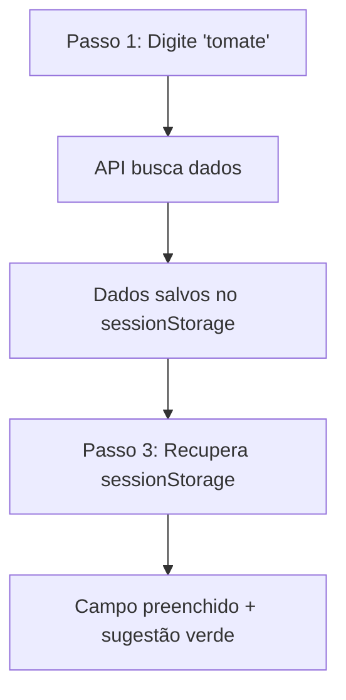
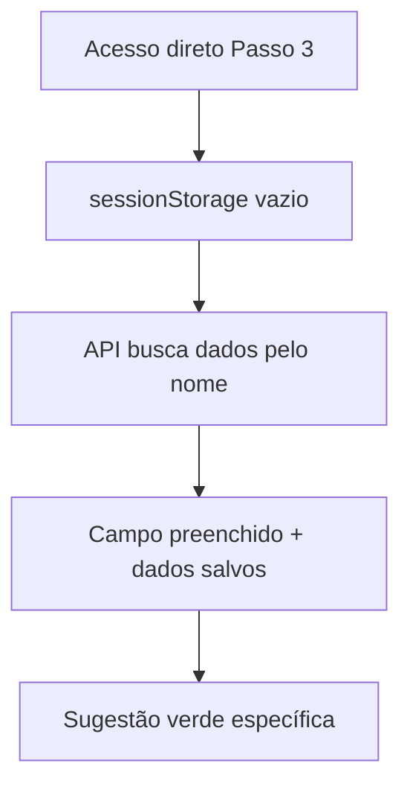
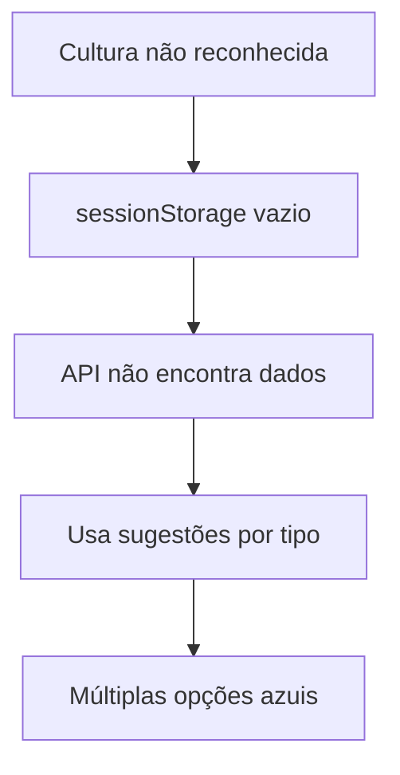

# 🔧 CORREÇÃO AVANÇADA: Sugestões de Ciclo da Cultura - Passo 3 do Wizard

## 🎯 Problema Identificado

No **passo 3** do wizard de criação de culturas (`/cultures/wizard?step=3`), o campo **"Ciclo da Cultura (dias)"** estava sugerindo intervalos genéricos baseados apenas no tipo de cultura, em vez de usar o valor específico da cultura selecionada.

### Comportamento Anterior (Incorreto):
```
💡 Sugestões baseadas no tipo de cultura:
30 dias | 45 dias | 60 dias | 75 dias | 90 dias
```

### Comportamento Desejado (Corrigido):
```
🎯 Ciclo específico desta cultura:
90 dias  <-- Valor específico do tomate
```

---

## 🛠️ Solução Avançada Implementada

### 1. **Múltiplas Fontes de Dados (Fallback Inteligente)**

A solução implementa uma estratégia robusta de múltiplas fontes:

#### **Prioridade 1: sessionStorage** (dados do passo 1)
- Recupera dados salvos quando usuário passou pelo fluxo completo
- Mais rápido e eficiente

#### **Prioridade 2: API em tempo real** 
- Busca dados diretamente na base de conhecimento
- Funciona mesmo se usuário acessou direto o passo 3
- Salva dados no sessionStorage para otimizar próximas consultas

#### **Prioridade 3: Sugestões genéricas** (fallback)
- Mantém funcionalidade para culturas desconhecidas
- Baseado no tipo da cultura selecionada

### 2. **Funções Implementadas:**

#### `aplicarDadosEspecificosCulturaAvancado(nomeCultura)`
- **Busca inteligente:** sessionStorage → API → fallback
- **Auto-preenchimento:** Campo preenchido automaticamente 
- **Cache automático:** Salva dados da API no sessionStorage

#### `mostrarSugestoesCiclo()` - Versão Melhorada
- **Detecção automática:** Verifica se campo já foi preenchido
- **Visual diferenciado:** Verde para específico, azul para genérico
- **Prioridade inteligente:** Input > sessionStorage > genérico

### 3. **Salvamento Automático no Passo 1:**

#### `salvarDadosParaProximosPassos(dados)` 
- **Execução automática:** Salva dados quando recebidos da API
- **Não depende do usuário:** Funciona mesmo sem clicar "Aplicar"
- **Logs detalhados:** Debug completo no console

---

## 🎨 Melhorias Visuais e UX

### **Dados Específicos (Verde):**
```html
🎯 Ciclo específico desta cultura:
[90 dias] ← Botão verde destacado
```

### **Dados Genéricos (Azul):**
```html
💡 Sugestões baseadas no tipo de cultura:
[30] [45] [60] [75] [90] ← Múltiplas opções azuis
```

### **Debug Avançado:**
- Logs detalhados em todas as etapas
- Rastreamento de fonte dos dados
- Identificação de problemas em tempo real

---

## 🔄 Fluxos Suportados

### **Fluxo Completo (Normal):**


### **Fluxo Direto (Usuário pula passo 1):**


### **Fluxo Fallback (Cultura desconhecida):**


---

## 📂 Arquivos Modificados

### `app/templates/cultures/wizard_step1.html`
- **Nova função:** `salvarDadosParaProximosPassos()`
- **Salvamento automático:** Dados salvos imediatamente após recebidos
- **Logs melhorados:** Debug completo do processo

### `app/templates/cultures/wizard_step3.html`
- **Função avançada:** `aplicarDadosEspecificosCulturaAvancado()`
- **Busca inteligente:** Múltiplas fontes de dados
- **Detecção aprimorada:** Verifica valor atual do campo
- **Logs detalhados:** Debug completo de todas as etapas

---

## 🧪 Como Testar

### **Cenário 1: Fluxo Completo (Ideal)**
1. `http://localhost:5000/cultures/wizard?step=1`
2. Digite: **"tomate"** 
3. Aguarde: Verificação automática (dados salvos automaticamente)
4. Avance: Para passo 3
5. **Resultado:** Campo = 90 dias + sugestão verde específica

### **Cenário 2: Acesso Direto ao Passo 3**
1. `http://localhost:5000/cultures/wizard?step=3`
2. Configure: Nome = "tomate", Tipo = "hortaliça"
3. **Resultado:** Sistema busca dados via API + preenche automaticamente

### **Cenário 3: Cultura Desconhecida**
1. Configure: Nome = "cultura inexistente"
2. **Resultado:** Sugestões genéricas azuis baseadas no tipo

### **Cenário 4: Debug no Console**
```javascript
// Verificar dados salvos:
console.log(sessionStorage.getItem('cultura_ciclo_dias'));

// Ver logs detalhados no console do browser
// Buscar por: "DEBUG:" nos logs
```

---

## ✅ Benefícios da Correção Avançada

### **Robustez:**
- ✅ Funciona em qualquer fluxo de navegação
- ✅ Múltiplas fontes de dados (sessionStorage + API)
- ✅ Fallback inteligente para casos edge

### **Performance:**
- ✅ Cache automático no sessionStorage
- ✅ Busca API apenas quando necessário
- ✅ Dados salvos automaticamente (sem ação do usuário)

### **Experiência:**
- ✅ Preenchimento automático inteligente
- ✅ Feedback visual claro (verde vs azul)
- ✅ Funciona independente do fluxo de navegação

### **Manutenibilidade:**
- ✅ Logs detalhados para debug
- ✅ Código modular e bem documentado
- ✅ Fácil adicionar novas fontes de dados

---

## 🎯 Resultado Final

A correção avançada garante que:

1. **Usuários normais:** Veem dados específicos da cultura (90 dias para tomate)
2. **Usuários que pulam passos:** Ainda recebem dados específicos via API
3. **Culturas desconhecidas:** Recebem sugestões úteis baseadas no tipo
4. **Desenvolvedores:** Têm logs detalhados para debugging

**O sistema agora é verdadeiramente inteligente e robusto, funcionando em qualquer cenário de uso.**
