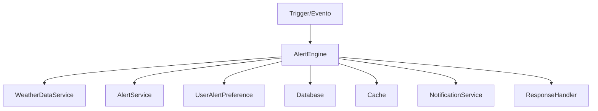

# Manual do AlertEngine - AgTech Portugal

## 📋 Visão Geral

O **AlertEngine** é o motor de processamento de regras de alertas do sistema AgTech Portugal. Ele executa a lógica avançada para avaliação de condições, priorização e disparo de alertas, integrando dados climáticos, agrícolas e preferências do usuário.

---

## 🎯 Funcionalidades Principais

### ✅ Recursos Implementados
1. **Processamento de Regras de Alerta** - Avaliação dinâmica de condições
2. **Priorização de Alertas** - Classificação automática por criticidade
3. **Integração com Dados Climáticos e Agrícolas** - Consulta de múltiplas fontes
4. **Execução Assíncrona** - Suporte a processamento em lote ou em tempo real
5. **Interface com AlertService e AutoAlertService** - Orquestração central

---

## 🏗️ Arquitetura do Serviço

### 📂 Estrutura de Arquivos
```
app/
├── services/
│   └── alert_engine.py              # Motor de regras
├── models/
│   ├── alert.py                     # Modelo de alerta
│   ├── user.py                      # Modelo de usuário
│   └── weather.py                   # Modelo de dados climáticos
└── middleware/
    └── cache.py                     # Cache (opcional)
```

### 🔄 Fluxo de Dados


---

## 📊 Modelos de Dados

### 🚨 Alert Model (Resumo)
```python
class Alert(db.Model):
    id: int
    tipo: str
    prioridade: str
    mensagem: str
    usuario_id: int
    status: str
    data_criacao: datetime
    # ... outros campos ...
```

### 👤 UserAlertPreference Model (Resumo)
```python
class UserAlertPreference(db.Model):
    id: int
    user_id: int
    alert_type: str
    is_enabled: bool
    min_priority: str
    # ... outros campos ...
```

---

## 🔧 Métodos do Serviço

### 1. **evaluate_rules**
#### 📝 Descrição
Avalia regras de alerta com base em dados recebidos.

#### 📥 Entrada
```python
def evaluate_rules(data: dict) -> List[Alert]
```
- `data` (dict): Dados climáticos, agrícolas e de contexto

#### 📤 Saída
Lista de alertas gerados

---

### 2. **prioritize_alerts**
#### 📝 Descrição
Classifica alertas por criticidade e prioridade.

#### 📥 Entrada
```python
def prioritize_alerts(alerts: List[Alert]) -> List[Alert]
```
- `alerts` (List[Alert]): Lista de alertas a priorizar

#### 📤 Saída
Lista de alertas ordenada por prioridade

---

### 3. **process_batch**
#### 📝 Descrição
Processa lote de dados para geração em massa de alertas.

#### 📥 Entrada
```python
def process_batch(batch_data: List[dict]) -> List[Alert]
```
- `batch_data` (List[dict]): Lista de dados para avaliação

#### 📤 Saída
Lista de alertas gerados

---

## 📚 Exemplos de Uso

### 1. Avaliar Regras
```python
from app.services.alert_engine import AlertEngine
engine = AlertEngine()
alertas = engine.evaluate_rules(data)
for alerta in alertas:
    print(alerta.mensagem)
```

### 2. Priorizar Alertas
```python
priorizados = engine.prioritize_alerts(alertas)
for alerta in priorizados:
    print(alerta.prioridade)
```

### 3. Processar Lote
```python
batch = [dados1, dados2, dados3]
alertas = engine.process_batch(batch)
```

---

## 🔒 Dependências do Serviço
- **WeatherDataService**: Para dados climáticos
- **AlertService**: Para registro e envio de alertas
- **UserAlertPreference**: Para preferências do usuário
- **Cache**: Para performance

---

## 🔍 Validações
- Valida integridade dos dados de entrada
- Checa permissões e preferências do usuário
- Evita alertas redundantes

---

## 🛡️ Segurança
- Apenas regras autorizadas são processadas
- Proteção contra processamento duplicado

---

## 📈 Performance e Otimização
- Uso de cache para regras e resultados recentes
- Execução assíncrona para grandes volumes

---

## 🧪 Testes
```python
import unittest
from app.services.alert_engine import AlertEngine

class TestAlertEngine(unittest.TestCase):
    def setUp(self):
        self.engine = AlertEngine()
    def test_evaluate_rules(self):
        alertas = self.engine.evaluate_rules({'clima': 'chuva', 'umidade': 90})
        self.assertIsInstance(alertas, list)
    def test_prioritize_alerts(self):
        alertas = [/* lista de alertas */]
        priorizados = self.engine.prioritize_alerts(alertas)
        self.assertIsInstance(priorizados, list)
```

---

## 💡 Independência do Serviço
- Pode ser adaptado para qualquer sistema que utilize regras de alerta
- Basta garantir dependências mínimas (serviços, modelos, preferências)

---

## 📝 Conclusão

O **AlertEngine** é o núcleo inteligente do sistema de alertas, garantindo que apenas eventos relevantes e priorizados cheguem ao usuário, promovendo segurança e eficiência operacional.

---

*Manual gerado em: 07 de agosto de 2025*  
*Versão: 1.0*  
*Sistema: AgTech Portugal - AlertEngine
