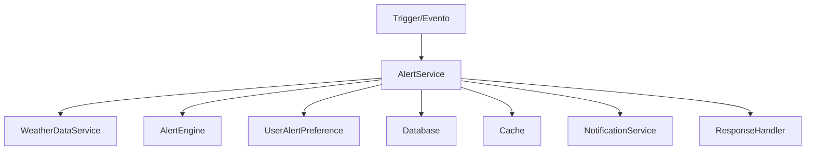

# Manual do AlertService - AgTech Portugal

## 📋 Visão Geral

O **AlertService** é o motor central para geração, processamento e gestão de alertas inteligentes no sistema AgTech Portugal. Ele integra dados climáticos, regras agrícolas e preferências do usuário para emitir notificações relevantes e priorizadas.

---

## 🎯 Funcionalidades Principais

### ✅ Recursos Implementados
1. **Geração Automática de Alertas** - Baseada em condições climáticas e regras agrícolas
2. **Processamento de Regras** - Avaliação dinâmica de condições e thresholds
3. **Integração com Dados Climáticos** - Consulta de dados meteorológicos locais
4. **Sistema de Prioridades** - Classificação e filtragem de alertas
5. **Preferências do Usuário** - Respeita configurações individuais de notificação
6. **Histórico e Status de Alertas** - Registro e atualização do ciclo de vida

---

## 🏗️ Arquitetura do Serviço

### 📂 Estrutura de Arquivos
```
app/
├── services/
│   └── alert_service.py            # Serviço principal
├── controllers/
│   └── alerts_controller.py        # Controlador REST
├── models/
│   ├── alert.py                    # Modelo de alerta
│   ├── user.py                     # Modelo de usuário
│   └── weather.py                  # Modelo de dados climáticos
└── middleware/
    └── cache.py                    # Cache (opcional)
```

### 🔄 Fluxo de Dados


---

## 📊 Modelos de Dados

### 🚨 Alert Model
```python
class Alert(db.Model):
    id: int
    tipo: str
    prioridade: str
    mensagem: str
    usuario_id: int
    status: str (novo, enviado, lido, resolvido)
    data_criacao: datetime
    data_envio: datetime
    data_leitura: datetime
    # ... outros campos ...
```

### 👤 UserAlertPreference Model
```python
class UserAlertPreference(db.Model):
    id: int
    user_id: int
    alert_type: str
    is_enabled: bool
    min_priority: str
    quiet_hours_start: time
    quiet_hours_end: time
    # ... outros campos ...
```

---

## 🔧 Métodos do Serviço

### 1. **generate_alerts**
#### 📝 Descrição
Gera alertas automaticamente com base em dados climáticos e regras.

#### 📥 Entrada
```python
def generate_alerts() -> List[Alert]
```

#### 📤 Saída
Lista de alertas gerados

---

### 2. **process_alert_rules**
#### 📝 Descrição
Processa regras de negócio para determinar necessidade de alerta.

#### 📥 Entrada
```python
def process_alert_rules(data: dict) -> List[Alert]
```
- `data` (dict): Dados climáticos e agrícolas

#### 📤 Saída
Lista de alertas processados

---

### 3. **get_user_alerts**
#### 📝 Descrição
Retorna todos os alertas do usuário, filtrando por status/prioridade.

#### 📥 Entrada
```python
def get_user_alerts(user_id: int, status: str = None) -> List[Alert]
```
- `user_id` (int): ID do usuário
- `status` (str, opcional): Filtro de status

#### 📤 Saída
Lista de alertas

---

### 4. **update_alert_status**
#### 📝 Descrição
Atualiza o status de um alerta (ex: lido, resolvido).

#### 📥 Entrada
```python
def update_alert_status(alert_id: int, status: str) -> bool
```
- `alert_id` (int): ID do alerta
- `status` (str): Novo status

#### 📤 Saída
`True` se atualizado com sucesso

---

### 5. **send_alert_notifications**
#### 📝 Descrição
Envia notificações de alerta conforme preferências do usuário.

#### 📥 Entrada
```python
def send_alert_notifications(alert: Alert) -> None
```
- `alert` (Alert): Instância do alerta

#### 📤 Saída
Notificação enviada (email, web, SMS)

---

## 📚 Exemplos de Uso

### 1. Gerar Alertas
```python
from app.services.alert_service import AlertService
service = AlertService()
alertas = service.generate_alerts()
for alerta in alertas:
    print(alerta.mensagem)
```

### 2. Buscar Alertas do Usuário
```python
alertas = service.get_user_alerts(user_id=1, status='novo')
for alerta in alertas:
    print(alerta.tipo, alerta.status)
```

### 3. Atualizar Status
```python
service.update_alert_status(alert_id=10, status='lido')
```

---

## 🔒 Dependências do Serviço
- **WeatherDataService**: Para dados climáticos
- **UserAlertPreference**: Para preferências de notificação
- **NotificationService**: Para envio de alertas
- **Cache**: Para performance

---

## 🔍 Validações
- Checa permissões do usuário
- Valida integridade dos dados de alerta
- Respeita preferências e horários de silêncio

---

## 🛡️ Segurança
- Apenas usuários autorizados podem acessar/atualizar seus alertas
- Proteção contra envio duplicado

---

## 📈 Performance e Otimização
- Uso de cache para alertas recentes
- Processamento assíncrono de notificações

---

## 🧪 Testes
```python
import unittest
from app.services.alert_service import AlertService

class TestAlertService(unittest.TestCase):
    def setUp(self):
        self.service = AlertService()
    def test_generate_alerts(self):
        alertas = self.service.generate_alerts()
        self.assertIsInstance(alertas, list)
    def test_update_status(self):
        self.assertTrue(self.service.update_alert_status(alert_id=1, status='lido'))
```

---

## 💡 Independência do Serviço
- Pode ser adaptado para qualquer sistema que possua dados climáticos e regras de alerta
- Basta garantir dependências mínimas (modelos, serviços, notificações)

---

## 📝 Conclusão

O **AlertService** é essencial para sistemas agrícolas inteligentes, promovendo segurança, proatividade e personalização na gestão de riscos e eventos críticos.

---

*Manual gerado em: 07 de agosto de 2025*  
*Versão: 1.0*  
*Sistema: AgTech Portugal - AlertService
