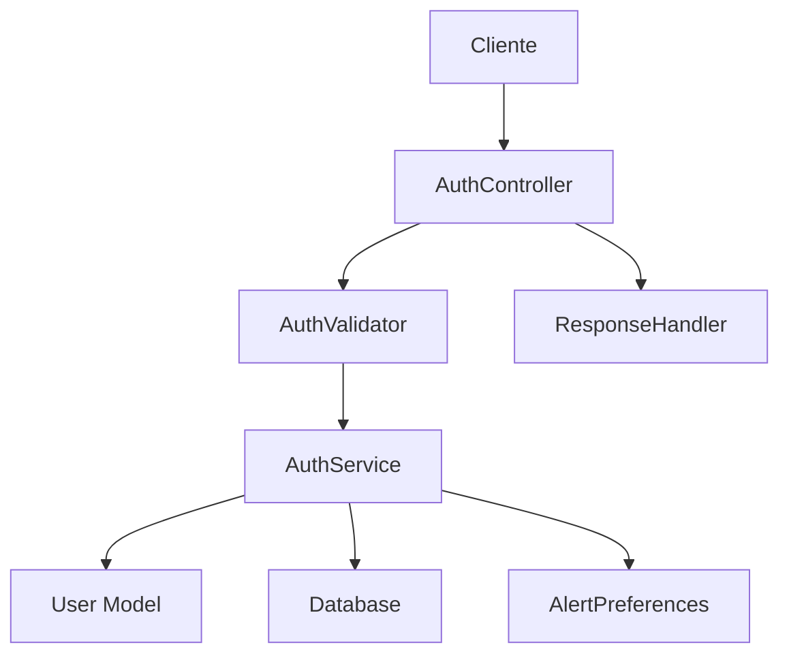

# Manual do AuthService - AgTech Portugal

## 📋 Visão Geral

O **AuthService** é o serviço principal responsável pela autenticação e autorização de usuários no sistema AgTech Portugal. Este manual fornece todas as informações necessárias para implementar e integrar este serviço em qualquer sistema.

---

## 🎯 Funcionalidades Principais

### ✅ Recursos Implementados
1. **Autenticação de Usuários** - Login/logout com validação
2. **Criação de Contas** - Registro com validação completa
3. **Gerenciamento de Onboarding** - Sistema de configuração inicial
4. **Preferências de Alertas** - Configuração automática
5. **Validação de Dados** - Sistema robusto de validação
6. **Geocodificação** - Suporte a localização com coordenadas
7. **Telefone Internacional** - Suporte a códigos de países

---

## 🏗️ Arquitetura do Serviço

### 📂 Estrutura de Arquivos
```
app/
├── services/
│   └── auth_service.py          # Serviço principal
├── controllers/
│   └── auth_controller.py       # Controlador REST
├── validators/
│   └── auth_validators.py       # Validações
├── models/
│   ├── user.py                  # Modelo de usuário
│   ├── alerts.py               # Preferências de alertas
│   └── farm.py                 # Propriedades agrícolas
└── middleware/
    ├── rate_limiter.py         # Limitação de requisições
    └── validation.py           # Validação de entrada
```

### 🔄 Fluxo de Dados


---

## 📊 Modelos de Dados

### 👤 User Model
```python
class User(UserMixin, db.Model):
    # Identificação
    id: int (PK)
    email: str (unique, required)
    password_hash: str (required)
    
    # Informações Pessoais
    nome_completo: str
    telefone: str
    experience_level: str (beginner/intermediate/advanced)
    
    # Localização
    propriedade_nome: str
    latitude: float
    longitude: float
    cidade: str
    estado: str
    country: str (default: 'Portugal')
    timezone: str (default: 'Europe/Lisbon')
    postal_code: str
    
    # Controle
    created_at: datetime
    updated_at: datetime
    ultimo_acesso: datetime
    is_active: bool (default: True)
    onboarding_completed: bool (default: False)
    
    # Relacionamentos
    farm: Farm (one-to-one)
    activities: List[Activity]
    marketplace_items: List[MarketplaceItem]
```

### 🚨 UserAlertPreference Model
```python
class UserAlertPreference(db.Model):
    id: int (PK)
    user_id: int (FK to User)
    alert_type: AlertType (enum)
    is_enabled: bool
    web_enabled: bool
    email_enabled: bool
    sms_enabled: bool
    min_priority: AlertPriority
    quiet_hours_start: time
    quiet_hours_end: time
    created_at: datetime
    updated_at: datetime
```

---

## 🔧 Métodos do Serviço

### 1. **authenticate_user**

#### 📝 Descrição
Autentica um usuário com email e senha.

#### 📥 Entrada
```python
def authenticate_user(email: str, password: str, remember: bool = False) -> Dict[str, Any]
```

**Parâmetros:**
- `email` (str, obrigatório): Email do usuário
- `password` (str, obrigatório): Senha em texto plano
- `remember` (bool, opcional): Se deve manter o login ativo (default: False)

#### 📤 Saída
```python
# Sucesso
{
    'success': True,
    'user': {
        'id': 1,
        'email': 'user@example.com',
        'nome_completo': 'João Silva',
        'experience_level': 'intermediate',
        'onboarding_completed': True,
        # ... outros campos
    },
    'needs_onboarding': False,
    'message': 'Login realizado com sucesso'
}

# Erro
{
    'success': False,
    'error': 'Credenciais inválidas',
    'status_code': 401
}
```

#### ⚙️ Comportamento
1. Busca usuário pelo email
2. Verifica hash da senha
3. Atualiza último acesso
4. Faz login via Flask-Login
5. Retorna dados do usuário

---

### 2. **create_user**

#### 📝 Descrição
Cria novo usuário no sistema com validações completas.

#### 📥 Entrada
```python
def create_user(
    email: str,
    password: str,
    nome_completo: str = '',
    telefone: str = '',
    location: str = '',
    latitude: float = None,
    longitude: float = None
) -> Dict[str, Any]
```

**Parâmetros:**
- `email` (str, obrigatório): Email único do usuário
- `password` (str, obrigatório): Senha em texto plano
- `nome_completo` (str, opcional): Nome completo
- `telefone` (str, opcional): Telefone com código do país (+351...)
- `location` (str, opcional): Localização textual
- `latitude` (float, opcional): Coordenada latitude
- `longitude` (float, opcional): Coordenada longitude

#### 📤 Saída
```python
# Sucesso
{
    'success': True,
    'user': { /* dados do usuário */ },
    'user_id': 123,
    'message': 'Conta criada com sucesso para user@example.com! Bem-vindo ao AgroTech Portugal.',
    'has_location': True,
    'has_coordinates': True,
    'has_phone': True
}

# Erro - Email existente
{
    'success': False,
    'error': 'Já existe uma conta com o email user@example.com. Tente fazer login ou use um email diferente.',
    'error_code': 'EMAIL_EXISTS',
    'status_code': 409
}

# Erro - Banco de dados
{
    'success': False,
    'error': 'Sistema temporariamente indisponível. Tente novamente em alguns segundos.',
    'error_code': 'DB_ERROR',
    'status_code': 500,
    'technical_error': 'UNIQUE constraint failed: users.email'
}
```

#### ⚙️ Comportamento
1. Verifica se email já existe
2. Valida e limpa dados de entrada
3. Cria hash da senha
4. Processa telefone (remove duplicação de código)
5. Salva coordenadas se disponíveis
6. Faz login automático
7. Retorna confirmação

---

### 3. **save_onboarding_step**

#### 📝 Descrição
Salva dados de uma etapa específica do processo de onboarding.

#### 📥 Entrada
```python
def save_onboarding_step(user: User, step: str, data: Dict[str, Any]) -> Dict[str, Any]
```

**Parâmetros:**
- `user` (User, obrigatório): Instância do usuário atual
- `step` (str, obrigatório): Etapa do onboarding ('1', '2', '3', '4', '5')
- `data` (dict, obrigatório): Dados da etapa

#### 📤 Saída
```python
# Sucesso
{
    'success': True,
    'message': 'Dados do passo 3 salvos com sucesso'
}

# Erro
{
    'success': False,
    'error': 'Nome da propriedade e localização são obrigatórios',
    'status_code': 500
}
```

#### ⚙️ Etapas do Onboarding

**Step 1: Nível de Experiência**
```python
data = {
    'experience_level': 'beginner'  # 'beginner', 'intermediate', 'advanced'
}
```

**Step 2: Dados Pessoais**
```python
data = {
    'full_name': 'João Silva',
    'phone': '912345678',
    'country_code': '+351',
    'farm_experience': 'intermediario',
    'producer_type': 'familiar',
    'interests': ['tomate', 'alface', 'cenoura']
}
```

**Step 3: Propriedade**
```python
data = {
    'farm_name': 'Quinta do João',
    'location': 'Lisboa, Portugal',
    'latitude': 38.7223,
    'longitude': -9.1393,
    'formatted_address': 'Rua das Flores, 123, Lisboa',
    'farm_area': '5.5',  # hectares
    'soil_type': 'argiloso',
    'climate': 'mediterrânico',
    'water_sources': ['poço', 'chuva']
}
```

**Step 4: Configurações**
```python
data = {
    'propriedade_nome': 'Quinta do João'
}
```

**Step 5: Finalização**
```python
data = {
    'complete_onboarding': True
}
```

---

### 4. **get_user_auth_status**

#### 📝 Descrição
Retorna o status atual de autenticação do usuário.

#### 📥 Entrada
```python
def get_user_auth_status(user) -> Dict[str, Any]
```

**Parâmetros:**
- `user` (User): Instância do current_user do Flask-Login

#### 📤 Saída
```python
# Usuário autenticado
{
    'authenticated': True,
    'user': { /* dados do usuário */ }
}

# Usuário não autenticado
{
    'authenticated': False
}
```

---

### 5. **_create_default_alert_preferences** (Método Privado)

#### 📝 Descrição
Cria preferências padrão de alertas para novos usuários.

#### ⚙️ Comportamento
1. Define configurações baseadas no nível de experiência
2. Iniciantes recebem mais notificações por email
3. Usuários avançados recebem apenas alertas de alta prioridade
4. Cria 9 tipos de preferências de alerta

#### 📋 Tipos de Alerta Configurados
- **WEATHER**: Alertas climáticos
- **PEST**: Pragas e doenças
- **DISEASE**: Doenças específicas
- **IRRIGATION**: Irrigação
- **FERTILIZATION**: Fertilização
- **HARVEST**: Colheita
- **PRUNING**: Poda
- **MARKET**: Oportunidades de mercado
- **GENERAL**: Alertas gerais

---

## 🔒 Dependências do Serviço

### 📦 Dependências Obrigatórias

#### 🐍 Python/Flask
```python
from flask import current_app
from flask_login import login_user
from werkzeug.security import check_password_hash, generate_password_hash
```

#### 🗄️ Database (SQLAlchemy)
```python
from app import db
from app.models.user import User
from app.models.alerts import UserAlertPreference, AlertType, AlertPriority
from app.models.farm import Farm
```

#### ✅ Validação
```python
from app.validators.auth_validators import AuthValidator
```

#### 📝 Logging
```python
import logging
```

### 🔄 Dependências Opcionais
- **Cache**: Para otimização de performance
- **Redis**: Para sessões distribuídas
- **Email Service**: Para confirmação de conta
- **SMS Service**: Para autenticação 2FA

---

## 🚀 Como Implementar em Outro Sistema

### 1. **Estrutura Mínima Necessária**

#### 📊 Banco de Dados
```sql
-- Tabela de usuários
CREATE TABLE users (
    id INTEGER PRIMARY KEY AUTOINCREMENT,
    email VARCHAR(120) UNIQUE NOT NULL,
    password_hash VARCHAR(255) NOT NULL,
    nome_completo VARCHAR(200),
    telefone VARCHAR(20),
    experience_level VARCHAR(20) DEFAULT 'beginner',
    propriedade_nome VARCHAR(120),
    latitude FLOAT,
    longitude FLOAT,
    cidade VARCHAR(100),
    estado VARCHAR(50),
    country VARCHAR(100) DEFAULT 'Portugal',
    timezone VARCHAR(50) DEFAULT 'Europe/Lisbon',
    postal_code VARCHAR(20),
    created_at DATETIME DEFAULT CURRENT_TIMESTAMP,
    updated_at DATETIME,
    ultimo_acesso DATETIME,
    is_active BOOLEAN DEFAULT 1,
    onboarding_completed BOOLEAN DEFAULT 0
);

-- Tabela de preferências de alertas
CREATE TABLE user_alert_preferences (
    id INTEGER PRIMARY KEY AUTOINCREMENT,
    user_id INTEGER NOT NULL,
    alert_type VARCHAR(50) NOT NULL,
    is_enabled BOOLEAN DEFAULT 1,
    web_enabled BOOLEAN DEFAULT 1,
    email_enabled BOOLEAN DEFAULT 0,
    sms_enabled BOOLEAN DEFAULT 0,
    min_priority VARCHAR(20) DEFAULT 'MEDIUM',
    quiet_hours_start TIME DEFAULT '22:00:00',
    quiet_hours_end TIME DEFAULT '08:00:00',
    created_at DATETIME DEFAULT CURRENT_TIMESTAMP,
    updated_at DATETIME,
    FOREIGN KEY (user_id) REFERENCES users (id)
);

-- Tabela de propriedades (opcional)
CREATE TABLE farms (
    id INTEGER PRIMARY KEY AUTOINCREMENT,
    name VARCHAR(200) NOT NULL,
    address TEXT,
    city VARCHAR(100),
    state VARCHAR(50),
    user_id INTEGER NOT NULL,
    area_total FLOAT DEFAULT 1.0,
    latitude FLOAT,
    longitude FLOAT,
    description TEXT,
    created_at DATETIME DEFAULT CURRENT_TIMESTAMP,
    updated_at DATETIME,
    is_active BOOLEAN DEFAULT 1,
    FOREIGN KEY (user_id) REFERENCES users (id)
);
```

#### 🔧 Configuração Flask
```python
# config.py
class Config:
    SECRET_KEY = 'your-secret-key'
    SQLALCHEMY_DATABASE_URI = 'sqlite:///app.db'
    SQLALCHEMY_TRACK_MODIFICATIONS = False

# app.py
from flask import Flask
from flask_sqlalchemy import SQLAlchemy
from flask_login import LoginManager

app = Flask(__name__)
app.config.from_object(Config)

db = SQLAlchemy(app)
login_manager = LoginManager(app)
login_manager.login_view = 'auth.login'

@login_manager.user_loader
def load_user(user_id):
    return User.query.get(int(user_id))
```

### 2. **Implementação Básica**

#### 📝 Modelo de Usuário Mínimo
```python
from flask_login import UserMixin
from werkzeug.security import generate_password_hash, check_password_hash
from datetime import datetime

class User(UserMixin, db.Model):
    __tablename__ = 'users'
    
    id = db.Column(db.Integer, primary_key=True)
    email = db.Column(db.String(120), unique=True, nullable=False)
    password_hash = db.Column(db.String(255), nullable=False)
    nome_completo = db.Column(db.String(200))
    is_active = db.Column(db.Boolean, default=True)
    created_at = db.Column(db.DateTime, default=datetime.utcnow)
    
    def set_password(self, password):
        self.password_hash = generate_password_hash(password)
    
    def check_password(self, password):
        return check_password_hash(self.password_hash, password)
    
    def to_dict(self):
        return {
            'id': self.id,
            'email': self.email,
            'nome_completo': self.nome_completo,
            'is_active': self.is_active
        }
```

#### 🔐 Serviço de Autenticação Simplificado
```python
from flask_login import login_user
from app.models import User, db
import logging

logger = logging.getLogger(__name__)

class AuthService:
    @staticmethod
    def authenticate_user(email: str, password: str) -> dict:
        try:
            user = User.query.filter_by(email=email).first()
            
            if not user or not user.check_password(password):
                return {
                    'success': False,
                    'error': 'Credenciais inválidas',
                    'status_code': 401
                }
            
            login_user(user)
            
            return {
                'success': True,
                'user': user.to_dict(),
                'message': 'Login realizado com sucesso'
            }
            
        except Exception as e:
            logger.error(f"Erro na autenticação: {e}")
            return {
                'success': False,
                'error': 'Erro interno',
                'status_code': 500
            }
    
    @staticmethod
    def create_user(email: str, password: str, nome_completo: str = '') -> dict:
        try:
            if User.query.filter_by(email=email).first():
                return {
                    'success': False,
                    'error': 'Email já cadastrado',
                    'status_code': 409
                }
            
            user = User(
                email=email,
                nome_completo=nome_completo
            )
            user.set_password(password)
            
            db.session.add(user)
            db.session.commit()
            
            login_user(user)
            
            return {
                'success': True,
                'user': user.to_dict(),
                'message': 'Conta criada com sucesso'
            }
            
        except Exception as e:
            logger.error(f"Erro ao criar usuário: {e}")
            db.session.rollback()
            return {
                'success': False,
                'error': 'Erro interno',
                'status_code': 500
            }
```

#### 🎮 Controlador Básico
```python
from flask import Blueprint, request, render_template, jsonify
from flask_login import logout_user, login_required, current_user
from app.services.auth_service import AuthService

auth_bp = Blueprint('auth', __name__)

@auth_bp.route('/login', methods=['GET', 'POST'])
def login():
    if request.method == 'GET':
        return render_template('login.html')
    
    data = request.get_json() or request.form
    result = AuthService.authenticate_user(
        email=data.get('email'),
        password=data.get('password')
    )
    
    if request.is_json:
        return jsonify(result), result.get('status_code', 200)
    
    if result['success']:
        return redirect(url_for('dashboard'))
    else:
        return render_template('login.html', error=result['error'])

@auth_bp.route('/register', methods=['GET', 'POST'])
def register():
    if request.method == 'GET':
        return render_template('register.html')
    
    data = request.get_json() or request.form
    result = AuthService.create_user(
        email=data.get('email'),
        password=data.get('password'),
        nome_completo=data.get('nome_completo', '')
    )
    
    if request.is_json:
        return jsonify(result), result.get('status_code', 200)
    
    if result['success']:
        return redirect(url_for('dashboard'))
    else:
        return render_template('register.html', error=result['error'])

@auth_bp.route('/logout')
@login_required
def logout():
    logout_user()
    return redirect(url_for('auth.login'))
```

---

## 🔍 Validações

### ✅ Validações de Entrada

#### 📧 Validação de Email
```python
import re

def is_valid_email(email: str) -> bool:
    pattern = r'^[a-zA-Z0-9._%+-]+@[a-zA-Z0-9.-]+\.[a-zA-Z]{2,}$'
    return bool(re.match(pattern, email))
```

#### 🔒 Validação de Senha
```python
def validate_password(password: str) -> tuple:
    if len(password) < 8:
        return False, 'Senha deve ter pelo menos 8 caracteres'
    
    if not re.search(r'[A-Za-z]', password):
        return False, 'Senha deve conter pelo menos uma letra'
    
    if not re.search(r'\d', password):
        return False, 'Senha deve conter pelo menos um número'
    
    return True, None
```

#### 📱 Validação de Telefone
```python
def validate_phone(phone: str) -> tuple:
    # Remove espaços e caracteres especiais
    clean_phone = re.sub(r'[^\d+]', '', phone)
    
    if not clean_phone.startswith('+'):
        return False, 'Telefone deve incluir código do país (+351, +55, etc.)'
    
    if len(clean_phone) < 10:
        return False, 'Telefone muito curto'
    
    return True, None
```

---

## 🛡️ Segurança

### 🔐 Medidas Implementadas
1. **Hash de Senhas**: Werkzeug PBKDF2 SHA256
2. **Rate Limiting**: Proteção contra ataques de força bruta
3. **Validação de Entrada**: Sanitização de dados
4. **CSRF Protection**: Tokens de proteção
5. **Session Management**: Flask-Login seguro

### 🚨 Recomendações de Segurança
```python
# Configurações recomendadas
app.config.update(
    SECRET_KEY='your-very-secret-key-here',
    SESSION_COOKIE_SECURE=True,      # HTTPS only
    SESSION_COOKIE_HTTPONLY=True,    # Previne XSS
    SESSION_COOKIE_SAMESITE='Lax',   # CSRF protection
    PERMANENT_SESSION_LIFETIME=3600,  # 1 hora
)

# Rate limiting
from flask_limiter import Limiter
from flask_limiter.util import get_remote_address

limiter = Limiter(
    app,
    key_func=get_remote_address,
    default_limits=["200 per day", "50 per hour"]
)

@auth_bp.route('/login', methods=['POST'])
@limiter.limit("5 per minute")
def login():
    # ... código do login
```

---

## 📈 Performance e Otimização

### ⚡ Cache de Usuários
```python
from flask_caching import Cache

cache = Cache(app, config={'CACHE_TYPE': 'simple'})

@cache.memoize(timeout=300)  # 5 minutos
def get_user_by_id(user_id):
    return User.query.get(user_id)
```

### 🗄️ Otimizações de Banco
```python
# Índices recomendados
db.Index('idx_user_email', User.email)
db.Index('idx_user_active', User.is_active)
db.Index('idx_user_created', User.created_at)

# Query otimizada
def get_active_users():
    return User.query.filter_by(is_active=True).options(
        db.selectinload(User.farm)
    ).all()
```

---

## 🧪 Testes

### 🔬 Testes Unitários
```python
import unittest
from app import create_app, db
from app.services.auth_service import AuthService

class TestAuthService(unittest.TestCase):
    def setUp(self):
        self.app = create_app('testing')
        self.app_context = self.app.app_context()
        self.app_context.push()
        db.create_all()
    
    def tearDown(self):
        db.session.remove()
        db.drop_all()
        self.app_context.pop()
    
    def test_create_user_success(self):
        result = AuthService.create_user(
            email='test@example.com',
            password='password123',
            nome_completo='Test User'
        )
        
        self.assertTrue(result['success'])
        self.assertEqual(result['user']['email'], 'test@example.com')
    
    def test_create_user_duplicate_email(self):
        # Criar primeiro usuário
        AuthService.create_user('test@example.com', 'password123')
        
        # Tentar criar duplicado
        result = AuthService.create_user('test@example.com', 'password456')
        
        self.assertFalse(result['success'])
        self.assertEqual(result['error_code'], 'EMAIL_EXISTS')
    
    def test_authenticate_user_success(self):
        # Criar usuário
        AuthService.create_user('test@example.com', 'password123')
        
        # Autenticar
        result = AuthService.authenticate_user('test@example.com', 'password123')
        
        self.assertTrue(result['success'])
        self.assertEqual(result['user']['email'], 'test@example.com')
    
    def test_authenticate_user_invalid_credentials(self):
        result = AuthService.authenticate_user('test@example.com', 'wrongpassword')
        
        self.assertFalse(result['success'])
        self.assertEqual(result['status_code'], 401)
```

---

## 📊 Monitoramento

### 📈 Métricas Importantes
```python
import logging
from datetime import datetime

class AuthMetrics:
    @staticmethod
    def log_login_attempt(email: str, success: bool, ip: str):
        logger.info(f"Login attempt: {email}, success: {success}, IP: {ip}")
    
    @staticmethod
    def log_registration(email: str, source: str):
        logger.info(f"New registration: {email}, source: {source}")
    
    @staticmethod
    def get_login_stats():
        from app.models import User
        
        return {
            'total_users': User.query.count(),
            'active_users': User.query.filter_by(is_active=True).count(),
            'completed_onboarding': User.query.filter_by(onboarding_completed=True).count(),
            'recent_logins': User.query.filter(
                User.ultimo_acesso > datetime.utcnow() - timedelta(days=30)
            ).count()
        }
```

---

## 🚨 Códigos de Erro

### 📋 Lista Completa de Erros
```python
AUTH_ERRORS = {
    'EMAIL_EXISTS': {
        'code': 409,
        'message': 'Email já cadastrado'
    },
    'INVALID_CREDENTIALS': {
        'code': 401,
        'message': 'Email ou senha inválidos'
    },
    'VALIDATION_ERROR': {
        'code': 400,
        'message': 'Dados inválidos'
    },
    'DB_ERROR': {
        'code': 500,
        'message': 'Erro interno do banco de dados'
    },
    'RATE_LIMIT': {
        'code': 429,
        'message': 'Muitas tentativas. Tente novamente em alguns minutos'
    },
    'USER_INACTIVE': {
        'code': 403,
        'message': 'Conta desativada'
    },
    'MISSING_FIELDS': {
        'code': 400,
        'message': 'Campos obrigatórios não preenchidos'
    }
}
```

---

## 📚 Exemplos de Uso

### 🔄 Fluxo Completo de Registro
```python
# 1. Criar usuário
result = AuthService.create_user(
    email='joao@farm.com',
    password='MinhaSenh@123',
    nome_completo='João Silva',
    telefone='+351912345678',
    location='Lisboa, Portugal',
    latitude=38.7223,
    longitude=-9.1393
)

if result['success']:
    user_id = result['user_id']
    
    # 2. Onboarding Step 1
    AuthService.save_onboarding_step(
        user=User.query.get(user_id),
        step='1',
        data={'experience_level': 'intermediate'}
    )
    
    # 3. Onboarding Step 2
    AuthService.save_onboarding_step(
        user=User.query.get(user_id),
        step='2',
        data={
            'farm_experience': 'intermediate',
            'interests': ['tomate', 'alface']
        }
    )
    
    # 4. Onboarding Step 3
    AuthService.save_onboarding_step(
        user=User.query.get(user_id),
        step='3',
        data={
            'farm_name': 'Quinta do João',
            'location': 'Lisboa, Portugal',
            'farm_area': '2.5',
            'soil_type': 'argiloso'
        }
    )
    
    # 5. Finalizar
    AuthService.save_onboarding_step(
        user=User.query.get(user_id),
        step='5',
        data={'complete_onboarding': True}
    )
```

---

## 💡 Independência do Serviço

### ✅ **Pode Funcionar Independentemente?**
**SIM**, com as seguintes adaptações:

### 🔧 Dependências Mínimas para Independência
1. **Flask + SQLAlchemy** (framework base)
2. **Flask-Login** (gestão de sessões)
3. **Werkzeug** (hash de senhas)
4. **Banco de dados** (SQLite, PostgreSQL, MySQL)

### 🚀 Implementação Standalone
```python
# standalone_auth.py
from flask import Flask, request, jsonify
from flask_sqlalchemy import SQLAlchemy
from flask_login import LoginManager, UserMixin, login_user, logout_user
from werkzeug.security import generate_password_hash, check_password_hash
import os

# Configuração mínima
app = Flask(__name__)
app.config['SECRET_KEY'] = 'your-secret-key'
app.config['SQLALCHEMY_DATABASE_URI'] = 'sqlite:///auth.db'

db = SQLAlchemy(app)
login_manager = LoginManager(app)

# Modelo mínimo
class User(UserMixin, db.Model):
    id = db.Column(db.Integer, primary_key=True)
    email = db.Column(db.String(120), unique=True, nullable=False)
    password_hash = db.Column(db.String(255), nullable=False)

@login_manager.user_loader
def load_user(user_id):
    return User.query.get(int(user_id))

# Serviço simplificado
class SimpleAuthService:
    @staticmethod
    def create_user(email, password):
        if User.query.filter_by(email=email).first():
            return {'success': False, 'error': 'Email exists'}
        
        user = User(email=email, password_hash=generate_password_hash(password))
        db.session.add(user)
        db.session.commit()
        
        return {'success': True, 'user_id': user.id}
    
    @staticmethod
    def authenticate(email, password):
        user = User.query.filter_by(email=email).first()
        if user and check_password_hash(user.password_hash, password):
            login_user(user)
            return {'success': True}
        return {'success': False}

# Rotas
@app.route('/register', methods=['POST'])
def register():
    data = request.json
    result = SimpleAuthService.create_user(data['email'], data['password'])
    return jsonify(result)

@app.route('/login', methods=['POST'])
def login():
    data = request.json
    result = SimpleAuthService.authenticate(data['email'], data['password'])
    return jsonify(result)

if __name__ == '__main__':
    with app.app_context():
        db.create_all()
    app.run(debug=True)
```

---

## 📝 Conclusão

O **AuthService** é um serviço robusto e completo que pode ser facilmente adaptado para outros sistemas. Ele oferece:

### ✅ **Pontos Fortes**
- ✅ Arquitetura modular e bem estruturada
- ✅ Validações completas de segurança
- ✅ Sistema de onboarding flexível
- ✅ Suporte a geocodificação
- ✅ Configuração automática de preferências
- ✅ Tratamento robusto de erros
- ✅ Logging detalhado para debugging

### 🎯 **Ideal Para**
- Sistemas de agricultura digital
- Plataformas de geolocalização
- Aplicações com onboarding complexo
- Sistemas que precisam de preferências de usuário
- Aplicações com múltiplos tipos de notificação

### 🛠️ **Para Implementar**
1. Copie os modelos de dados
2. Adapte as validações às suas necessidades
3. Configure o banco de dados
4. Implemente as rotas necessárias
5. Ajuste as preferências padrão

---

*Manual gerado em: 07 de agosto de 2025*  
*Versão: 1.0*  
*Sistema: AgTech Portugal - AuthService*
