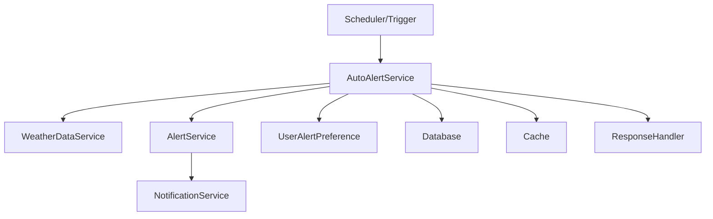

# Manual do AutoAlertService - AgTech Portugal

## 📋 Visão Geral

O **AutoAlertService** é responsável pela geração automatizada de alertas no sistema AgTech Portugal, monitorando condições e triggers em tempo real para acionar notificações sem intervenção manual. Ele integra dados de clima, regras agrícolas e preferências do usuário, atuando como um orquestrador de alertas proativos.

---

## 🎯 Funcionalidades Principais

### ✅ Recursos Implementados
1. **Monitoramento Contínuo de Triggers** - Observa condições predefinidas
2. **Geração Automática de Alertas** - Cria alertas sem ação do usuário
3. **Integração com AlertService** - Encaminha alertas para processamento
4. **Consulta a WeatherDataService** - Usa dados climáticos em tempo real
5. **Agendamento e Execução Periódica** - Pode rodar em background ou via scheduler
6. **Respeito às Preferências do Usuário** - Só gera alertas relevantes

---

## 🏗️ Arquitetura do Serviço

### 📂 Estrutura de Arquivos
```
app/
├── services/
│   └── auto_alert_service.py         # Serviço principal
├── controllers/
│   └── alerts_controller.py          # Controlador REST (compartilhado)
├── models/
│   ├── alert.py                      # Modelo de alerta
│   ├── user.py                       # Modelo de usuário
│   └── weather.py                    # Modelo de dados climáticos
└── middleware/
    └── scheduler.py                  # Agendador de tarefas (opcional)
```

### 🔄 Fluxo de Dados


---

## 📊 Modelos de Dados

### 🚨 Alert Model (Resumo)
```python
class Alert(db.Model):
    id: int
    tipo: str
    prioridade: str
    mensagem: str
    usuario_id: int
    status: str
    data_criacao: datetime
    # ... outros campos ...
```

### 👤 UserAlertPreference Model (Resumo)
```python
class UserAlertPreference(db.Model):
    id: int
    user_id: int
    alert_type: str
    is_enabled: bool
    min_priority: str
    # ... outros campos ...
```

---

## 🔧 Métodos do Serviço

### 1. **run_auto_alerts**
#### 📝 Descrição
Executa o ciclo de monitoramento e geração automática de alertas.

#### 📥 Entrada
```python
def run_auto_alerts() -> List[Alert]
```

#### 📤 Saída
Lista de alertas gerados automaticamente

---

### 2. **check_triggers**
#### 📝 Descrição
Verifica condições e triggers para decidir se um alerta deve ser criado.

#### 📥 Entrada
```python
def check_triggers(data: dict) -> List[Alert]
```
- `data` (dict): Dados climáticos e de contexto

#### 📤 Saída
Lista de alertas a serem criados

---

### 3. **schedule_auto_alerts**
#### 📝 Descrição
Agenda a execução periódica do serviço de alertas automáticos.

#### 📥 Entrada
```python
def schedule_auto_alerts(interval: int) -> None
```
- `interval` (int): Intervalo em minutos

#### 📤 Saída
Nenhuma (executa em background)

---

## 📚 Exemplos de Uso

### 1. Rodar AutoAlert Manualmente
```python
from app.services.auto_alert_service import AutoAlertService
service = AutoAlertService()
alertas = service.run_auto_alerts()
for alerta in alertas:
    print(alerta.mensagem)
```

### 2. Agendar Execução Periódica
```python
service.schedule_auto_alerts(interval=30)  # Executa a cada 30 minutos
```

---

## 🔒 Dependências do Serviço
- **AlertService**: Para criação e processamento de alertas
- **WeatherDataService**: Para dados climáticos
- **UserAlertPreference**: Para preferências do usuário
- **Scheduler**: Para execução periódica (opcional)
- **Cache**: Para performance

---

## 🔍 Validações
- Checa permissões e preferências do usuário
- Valida integridade dos dados de trigger
- Evita alertas duplicados

---

## 🛡️ Segurança
- Apenas triggers autorizadas podem gerar alertas
- Proteção contra execução concorrente

---

## 📈 Performance e Otimização
- Uso de cache para triggers recentes
- Execução assíncrona e agendada

---

## 🧪 Testes
```python
import unittest
from app.services.auto_alert_service import AutoAlertService

class TestAutoAlertService(unittest.TestCase):
    def setUp(self):
        self.service = AutoAlertService()
    def test_run_auto_alerts(self):
        alertas = self.service.run_auto_alerts()
        self.assertIsInstance(alertas, list)
```

---

## 💡 Independência do Serviço
- Pode ser adaptado para qualquer sistema que possua triggers e alertas
- Basta garantir dependências mínimas (serviços, modelos, scheduler)

---

## 📝 Conclusão

O **AutoAlertService** automatiza a geração de alertas, tornando o sistema mais proativo e seguro para o usuário agrícola. Ideal para plataformas que exigem monitoramento contínuo e respostas rápidas a eventos críticos.

---

*Manual gerado em: 07 de agosto de 2025*  
*Versão: 1.0*  
*Sistema: AgTech Portugal - AutoAlertService
