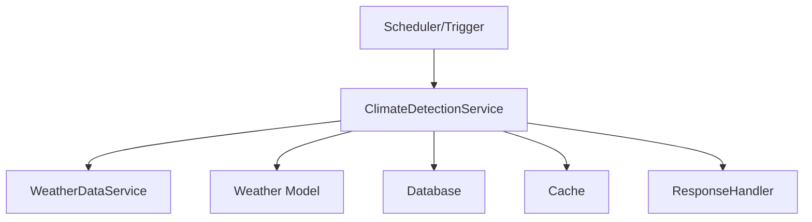

# Manual do ClimateDetectionService - AgTech Portugal

## 📋 Visão Geral

O **ClimateDetectionService** é responsável pela detecção automática de padrões e tendências climáticas regionais no sistema AgTech Portugal. Ele analisa dados históricos e atuais para identificar mudanças, anomalias e fornecer insights para tomada de decisão agrícola.

---

## 🎯 Funcionalidades Principais

### ✅ Recursos Implementados
1. **Análise de Tendências Climáticas** - Identificação de padrões regionais
2. **Detecção de Anomalias** - Sinalização de eventos fora do padrão
3. **Classificação de Climas** - Categorização automática por região
4. **Geração de Relatórios** - Insights para o usuário e para o sistema
5. **Integração com WeatherDataService** - Consome dados climáticos locais

---

## 🏗️ Arquitetura do Serviço

### 📂 Estrutura de Arquivos
```
app/
├── services/
│   └── climate_detection_service.py      # Serviço principal
├── models/
│   └── weather.py                       # Modelo de dados climáticos
└── middleware/
    └── cache.py                         # Cache (opcional)
```

### 🔄 Fluxo de Dados


---

## 📊 Modelos de Dados

### ☁️ Weather Model (Resumo)
```python
class Weather(db.Model):
    id: int
    data: datetime
    temperatura: float
    umidade: float
    precipitacao: float
    vento: float
    localizacao: str
    latitude: float
    longitude: float
    # ... outros campos ...
```

---

## 🔧 Métodos do Serviço

### 1. **detect_climate_patterns**
#### 📝 Descrição
Analisa dados históricos para identificar padrões climáticos regionais.

#### 📥 Entrada
```python
def detect_climate_patterns(region: str = None, latitude: float = None, longitude: float = None) -> dict
```
- `region` (str, opcional): Nome da região
- `latitude` (float, opcional)
- `longitude` (float, opcional)

#### 📤 Saída
Dicionário com padrões detectados

---

### 2. **detect_anomalies**
#### 📝 Descrição
Detecta eventos climáticos fora do padrão esperado.

#### 📥 Entrada
```python
def detect_anomalies(region: str = None, latitude: float = None, longitude: float = None) -> List[dict]
```
- `region` (str, opcional)
- `latitude` (float, opcional)
- `longitude` (float, opcional)

#### 📤 Saída
Lista de anomalias detectadas

---

### 3. **classify_climate**
#### 📝 Descrição
Classifica o clima de uma região com base em dados históricos.

#### 📥 Entrada
```python
def classify_climate(region: str = None, latitude: float = None, longitude: float = None) -> str
```
- `region` (str, opcional)
- `latitude` (float, opcional)
- `longitude` (float, opcional)

#### 📤 Saída
String com a classificação climática

---

### 4. **generate_report**
#### 📝 Descrição
Gera relatório consolidado de tendências e anomalias.

#### 📥 Entrada
```python
def generate_report(region: str = None, latitude: float = None, longitude: float = None) -> dict
```
- `region` (str, opcional)
- `latitude` (float, opcional)
- `longitude` (float, opcional)

#### 📤 Saída
Dicionário com resumo e insights

---

## 📚 Exemplos de Uso

### 1. Detectar Padrões Climáticos
```python
from app.services.climate_detection_service import ClimateDetectionService
service = ClimateDetectionService()
result = service.detect_climate_patterns(region='Alentejo')
print(result)
```

### 2. Detectar Anomalias
```python
anomalias = service.detect_anomalies(latitude=38.7, longitude=-9.1)
for evento in anomalias:
    print(evento)
```

### 3. Classificar Clima
```python
clima = service.classify_climate(region='Norte')
print(clima)
```

### 4. Gerar Relatório
```python
relatorio = service.generate_report(region='Centro')
print(relatorio['resumo'])
```

---

## 🔒 Dependências do Serviço
- **WeatherDataService**: Para dados climáticos
- **Weather Model**: Para persistência e consulta
- **Cache**: Para performance

---

## 🔍 Validações
- Checa existência de dados suficientes para análise
- Valida integridade dos dados históricos

---

## 🛡️ Segurança
- Apenas dados do banco local são utilizados
- Não expõe dados sensíveis

---

## 📈 Performance e Otimização
- Uso de cache para resultados de análises
- Execução assíncrona para grandes volumes

---

## 🧪 Testes
```python
import unittest
from app.services.climate_detection_service import ClimateDetectionService

class TestClimateDetectionService(unittest.TestCase):
    def setUp(self):
        self.service = ClimateDetectionService()
    def test_detect_climate_patterns(self):
        result = self.service.detect_climate_patterns(region='Alentejo')
        self.assertIsInstance(result, dict)
    def test_classify_climate(self):
        clima = self.service.classify_climate(region='Norte')
        self.assertIsInstance(clima, str)
```

---

## 💡 Independência do Serviço
- Pode ser adaptado para qualquer sistema que possua dados climáticos históricos
- Basta garantir dependências mínimas (modelos, banco, cache)

---

## 📝 Conclusão

O **ClimateDetectionService** agrega inteligência ao sistema agrícola, permitindo antecipação de riscos e melhor planejamento com base em tendências e anomalias climáticas.

---

*Manual gerado em: 07 de agosto de 2025*  
*Versão: 1.0*  
*Sistema: AgTech Portugal - ClimateDetectionService
