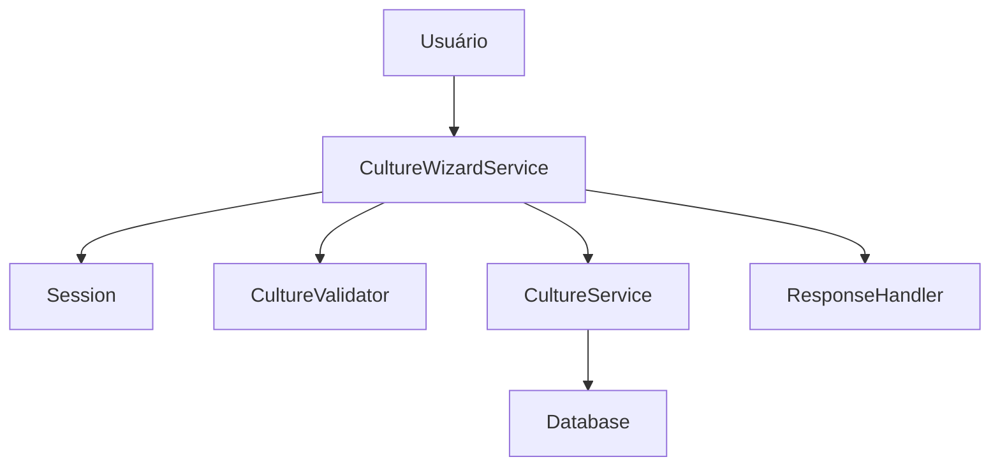

# Manual do CultureWizardService - AgTech Portugal

## 📋 Visão Geral

O **CultureWizardService** é um assistente guiado para o cadastro de culturas agrícolas, facilitando o processo passo a passo para o usuário. Ele gerencia o fluxo de etapas, validação de dados em cada fase e integração com o serviço principal de culturas.

---

## 🎯 Funcionalidades Principais

### ✅ Recursos Implementados
1. **Fluxo de Cadastro Guiado** - Passos sequenciais para entrada de dados
2. **Persistência Temporária** - Uso de sessão para armazenar dados parciais
3. **Validação em Cada Etapa** - Checagem de integridade antes de avançar
4. **Finalização e Criação** - Geração do registro de cultura ao final do wizard
5. **Reentrada e Continuidade** - Permite retomar wizard interrompido

---

## 🏗️ Arquitetura do Serviço

### 📂 Estrutura de Arquivos
```
app/
├── services/
│   └── culture_service.py
│   └── culture_wizard_service.py   # Wizard principal
├── controllers/
│   └── culture_controller.py
├── validators/
│   └── culture_validators.py
├── models/
│   └── culture.py
└── ...
```

### 🔄 Fluxo de Dados


---

## 📊 Modelos de Dados Utilizados

- **Culture**: Modelo de cultura agrícola
- **Session**: Armazena dados temporários do wizard

---

## 🔧 Métodos do Serviço

### 1. **start**
#### 📝 Descrição
Inicia o wizard de cadastro para o usuário.

#### 📥 Entrada
```python
def start(self) -> None
```

#### 📤 Saída
Wizard iniciado, sessão limpa para novo fluxo.

---

### 2. **set_step_data**
#### 📝 Descrição
Armazena dados de uma etapa específica do wizard.

#### 📥 Entrada
```python
def set_step_data(self, step: str, data: Any) -> None
```
- `step` (str): Nome ou número da etapa
- `data` (Any): Dados informados pelo usuário

#### 📤 Saída
Dados salvos na sessão temporária.

---

### 3. **get_step_data**
#### 📝 Descrição
Recupera dados já preenchidos de uma etapa.

#### 📥 Entrada
```python
def get_step_data(self, step: str) -> Any
```
- `step` (str): Nome ou número da etapa

#### 📤 Saída
Dados da etapa, se existirem.

---

### 4. **validate_step**
#### 📝 Descrição
Valida os dados da etapa corrente usando regras do negócio.

#### 📥 Entrada
```python
def validate_step(self, step: str) -> tuple
```
- `step` (str): Nome ou número da etapa

#### 📤 Saída
- `(bool, str)`: Sucesso e mensagem de erro (se houver)

---

### 5. **finish**
#### 📝 Descrição
Finaliza o wizard, valida todos os dados e cria a cultura.

#### 📥 Entrada
```python
def finish(self) -> bool
```

#### 📤 Saída
- `True` se cultura criada com sucesso
- `False` se houver erro de validação

---

## 📚 Exemplo de Uso
```python
from app.services.culture_service import CultureWizardService
wizard = CultureWizardService(user_id=1)
wizard.start()
wizard.set_step_data('nome', 'Soja')
wizard.set_step_data('tipo', 'Grão')
wizard.set_step_data('area', 20)
if wizard.validate_step('area')[0]:
    sucesso = wizard.finish()
    print('Cultura criada:', sucesso)
```

---

## 🔒 Dependências do Serviço
- **Session**: Para persistência temporária
- **CultureService**: Para criação final
- **CultureValidator**: Para validação de cada etapa

---

## 🔍 Validações
- Cada etapa possui validação específica (ex: nome não vazio, área positiva)
- Validação final antes de criar cultura

---

## 🛡️ Segurança
- Dados do wizard ficam restritos à sessão do usuário
- Não expõe dados sensíveis

---

## 📈 Performance
- Uso de sessão evita gravações desnecessárias no banco
- Apenas ao final do wizard ocorre persistência

---

## 🧪 Testes
```python
import unittest
from app.services.culture_service import CultureWizardService

class TestCultureWizardService(unittest.TestCase):
    def setUp(self):
        self.wizard = CultureWizardService(user_id=1)
        self.wizard.start()
    def test_wizard_flow(self):
        self.wizard.set_step_data('nome', 'Milho')
        self.wizard.set_step_data('area', 10)
        self.assertTrue(self.wizard.validate_step('area')[0])
        self.assertTrue(self.wizard.finish())
```

---

## 💡 Independência do Serviço
- Pode ser adaptado para qualquer sistema que utilize sessão e CRUD de culturas
- Basta garantir dependências mínimas (session, models, validação)

---

## 📝 Conclusão

O **CultureWizardService** simplifica o cadastro de culturas, reduz erros e melhora a experiência do usuário. Ideal para sistemas agrícolas digitais que exigem processos guiados e seguros.

---

*Manual gerado em: 07 de agosto de 2025*  
*Versão: 1.0*  
*Sistema: AgTech Portugal - CultureWizardService
