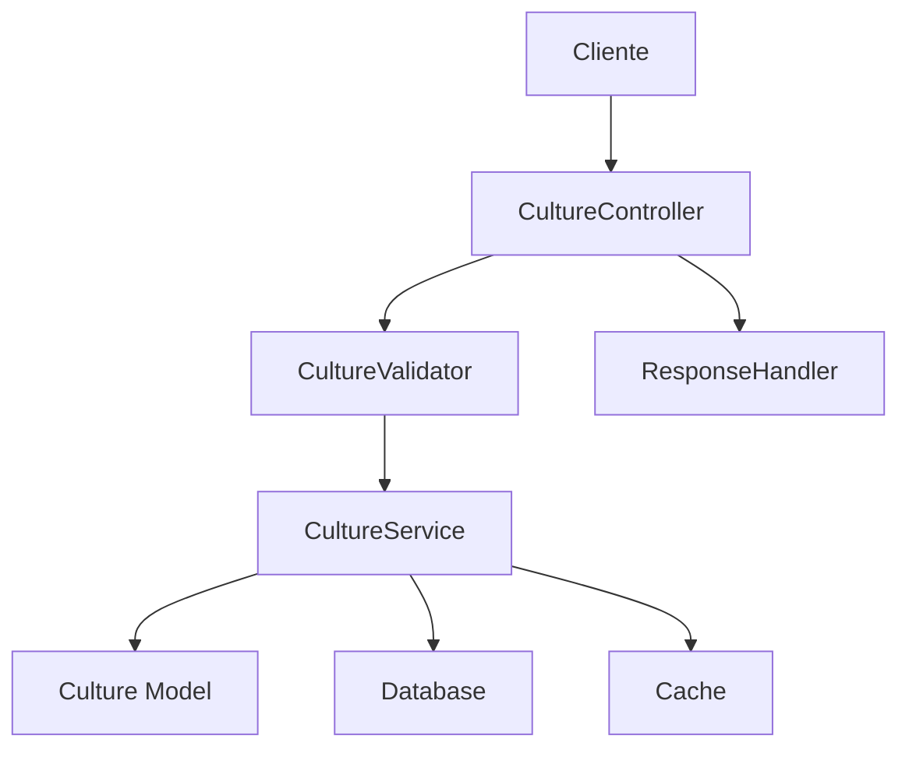

# MANUAL_CULTURESERVICE.md

# Manual do CultureService - AgTech Portugal

## 📋 Visão Geral

O **CultureService** é o serviço responsável pela gestão de culturas agrícolas no sistema AgTech Portugal. Este manual detalha todas as informações necessárias para implementar, integrar e adaptar o serviço em qualquer sistema.

---

## 🎯 Funcionalidades Principais

### ✅ Recursos Implementados
1. **CRUD de Culturas** - Criação, leitura, atualização e remoção
2. **Validação de Dados** - Garantia de integridade e regras de negócio
3. **Gestão de Culturas por Usuário** - Culturas associadas a cada usuário
4. **Cache Otimizado** - Performance em consultas
5. **Assistente de Cadastro (Wizard)** - Processo guiado de criação
6. **Integração com Validadores** - Validação automática

---

## 🏗️ Arquitetura do Serviço

### 📂 Estrutura de Arquivos
```
app/
├── services/
│   └── culture_service.py         # Serviço principal
├── controllers/
│   └── culture_controller.py      # Controlador REST
├── validators/
│   └── culture_validators.py      # Validações
├── models/
│   ├── culture.py                 # Modelo de cultura
│   └── user.py                    # Modelo de usuário
└── middleware/
    └── cache.py                   # Cache (opcional)
```

### 🔄 Fluxo de Dados


---

## 📊 Modelos de Dados

### 🌱 Culture Model
```python
class Culture(db.Model):
    id: int (PK)
    nome: str (obrigatório)
    tipo: str (ex: Grão, Hortaliça)
    area: float (hectares)
    usuario_id: int (FK para User)
    data_plantio: date
    data_colheita: date
    status: str (ativo/inativo)
    created_at: datetime
    updated_at: datetime
```

### 👤 User Model (associação)
```python
class User(db.Model):
    id: int (PK)
    email: str
    # ... outros campos ...
    culturas: List[Culture]  # relacionamento
```

---

## 🔧 Métodos do Serviço

### 1. **create_culture**
#### 📝 Descrição
Cria uma nova cultura para um usuário.

#### 📥 Entrada
```python
def create_culture(data: dict) -> Culture
```
**Parâmetros:**
- `data` (dict):
    - `nome` (str, obrigatório)
    - `tipo` (str, obrigatório)
    - `area` (float, obrigatório)
    - `usuario_id` (int, obrigatório)

#### 📤 Saída
Objeto `Culture` criado

---

### 2. **get_cultures_by_user**
#### 📝 Descrição
Lista todas as culturas de um usuário.

#### 📥 Entrada
```python
def get_cultures_by_user(user_id: int) -> List[Culture]
```
**Parâmetros:**
- `user_id` (int): ID do usuário

#### 📤 Saída
Lista de objetos `Culture`

---

### 3. **update_culture**
#### 📝 Descrição
Atualiza dados de uma cultura existente.

#### 📥 Entrada
```python
def update_culture(culture_id: int, data: dict) -> Culture
```
**Parâmetros:**
- `culture_id` (int): ID da cultura
- `data` (dict): Campos a atualizar

#### 📤 Saída
Objeto `Culture` atualizado

---

### 4. **delete_culture**
#### 📝 Descrição
Remove uma cultura do sistema.

#### 📥 Entrada
```python
def delete_culture(culture_id: int) -> bool
```
**Parâmetros:**
- `culture_id` (int): ID da cultura

#### 📤 Saída
`True` se removido com sucesso

---

### 5. **CultureWizardService**
#### 📝 Descrição
Assistente de cadastro guiado de culturas, utilizando sessão do usuário.

#### 📥 Entrada
Passos do wizard via sessão

#### 📤 Saída
Cultura criada ao final do processo

---

## 📚 Exemplos de Uso

### 1. Criar Cultura
```python
from app.services.culture_service import CultureService
service = CultureService()
cultura = service.create_culture({'nome': 'Milho', 'tipo': 'Grão', 'area': 10, 'usuario_id': 1})
```

### 2. Listar Culturas
```python
culturas = service.get_cultures_by_user(user_id=1)
for cultura in culturas:
    print(cultura.nome)
```

### 3. Atualizar Cultura
```python
service.update_culture(culture_id=5, data={'area': 12.0})
```

### 4. Remover Cultura
```python
service.delete_culture(culture_id=5)
```

### 5. Usar o Wizard
```python
from app.services.culture_service import CultureWizardService
wizard = CultureWizardService(user_id=1)
wizard.start()
wizard.set_step_data('nome', 'Soja')
wizard.set_step_data('area', 20)
finalizada = wizard.finish()
```

---

## 🔒 Dependências do Serviço

### 📦 Dependências Obrigatórias
```python
from flask import current_app
from flask_sqlalchemy import SQLAlchemy
from app.models.culture import Culture
from app.models.user import User
from app.validators.culture_validators import CultureValidator
from flask_caching import Cache
```

### 🔄 Dependências Opcionais
- **Cache**: Para performance
- **Session**: Para wizard
- **Validações customizadas**

---

## 🔍 Validações

### ✅ Validações de Entrada
```python
def validate_culture_data(data: dict) -> tuple:
    if not data.get('nome'):
        return False, 'Nome da cultura é obrigatório'
    if not data.get('tipo'):
        return False, 'Tipo é obrigatório'
    if not isinstance(data.get('area'), (int, float)) or data['area'] <= 0:
        return False, 'Área deve ser positiva'
    return True, None
```

---

## 🛡️ Segurança

### 🔐 Medidas Implementadas
1. **Validação de Entrada**: Sanitização de dados
2. **Controle de Permissões**: Usuário só acessa suas culturas
3. **Proteção de Sessão**: Wizard usa sessão segura

---

## 📈 Performance e Otimização

### ⚡ Cache de Culturas
```python
from flask_caching import Cache

cache = Cache(config={'CACHE_TYPE': 'simple'})

@cache.memoize(timeout=300)
def get_cultures_by_user(user_id):
    return Culture.query.filter_by(usuario_id=user_id).all()
```

---

## 🧪 Testes

### 🔬 Testes Unitários
```python
import unittest
from app import create_app, db
from app.services.culture_service import CultureService

class TestCultureService(unittest.TestCase):
    def setUp(self):
        self.app = create_app('testing')
        self.app_context = self.app.app_context()
        self.app_context.push()
        db.create_all()
    def tearDown(self):
        db.session.remove()
        db.drop_all()
        self.app_context.pop()
    def test_create_culture_success(self):
        result = CultureService().create_culture({'nome': 'Trigo', 'tipo': 'Grão', 'area': 5, 'usuario_id': 1})
        self.assertIsNotNone(result.id)
        self.assertEqual(result.nome, 'Trigo')
    def test_create_culture_invalid(self):
        with self.assertRaises(ValueError):
            CultureService().create_culture({'nome': '', 'tipo': '', 'area': -1, 'usuario_id': 1})
```

---

## 💡 Independência do Serviço

### ✅ **Pode Funcionar Independentemente?**
**SIM**, desde que as dependências de modelo, banco, cache e validação sejam satisfeitas.

### 🔧 Dependências Mínimas para Independência
1. **Flask + SQLAlchemy**
2. **Modelos de dados compatíveis**
3. **Validação customizada**
4. **Cache (opcional)**

### 🚀 Implementação Standalone
```python
# standalone_culture.py
from flask import Flask, request, jsonify
from flask_sqlalchemy import SQLAlchemy
from datetime import datetime

app = Flask(__name__)
app.config['SQLALCHEMY_DATABASE_URI'] = 'sqlite:///cultures.db'
db = SQLAlchemy(app)

class Culture(db.Model):
    id = db.Column(db.Integer, primary_key=True)
    nome = db.Column(db.String(120), nullable=False)
    tipo = db.Column(db.String(50), nullable=False)
    area = db.Column(db.Float, nullable=False)
    usuario_id = db.Column(db.Integer, nullable=False)
    created_at = db.Column(db.DateTime, default=datetime.utcnow)

@app.route('/cultures', methods=['POST'])
def create_culture():
    data = request.json
    if not data.get('nome') or not data.get('tipo') or not data.get('area'):
        return jsonify({'success': False, 'error': 'Dados obrigatórios faltando'}), 400
    cultura = Culture(
        nome=data['nome'],
        tipo=data['tipo'],
        area=data['area'],
        usuario_id=data['usuario_id']
    )
    db.session.add(cultura)
    db.session.commit()
    return jsonify({'success': True, 'id': cultura.id})

if __name__ == '__main__':
    with app.app_context():
        db.create_all()
    app.run(debug=True)
```

---

## 📝 Conclusão

O **CultureService** é robusto, modular e pode ser facilmente adaptado para outros sistemas agrícolas ou de gestão de dados. Ele oferece:

### ✅ **Pontos Fortes**
- Arquitetura clara e modular
- Validação de dados robusta
- Performance otimizada com cache
- Assistente de cadastro guiado
- Fácil integração com outros módulos

### 🎯 **Ideal Para**
- Sistemas agrícolas digitais
- Plataformas de gestão de culturas
- Aplicações multiusuário

### 🛠️ **Para Implementar**
1. Copie os modelos de dados
2. Adapte as validações
3. Configure o banco de dados
4. Implemente as rotas necessárias
5. Ajuste regras de negócio conforme o contexto

---

*Manual gerado em: 07 de agosto de 2025*  
*Versão: 1.0*  
*Sistema: AgTech Portugal - CultureService*
