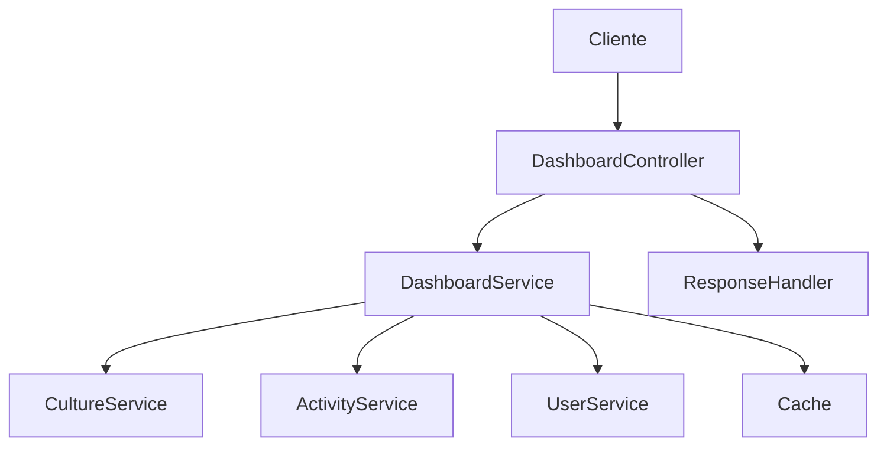

# Manual do DashboardService - AgTech Portugal

## 📋 Visão Geral

O **DashboardService** é responsável por fornecer dados consolidados, métricas e estatísticas para o painel principal do sistema AgTech Portugal. Ele centraliza informações relevantes para o usuário, como status de culturas, atividades recentes e indicadores de performance.

---

## 🎯 Funcionalidades Principais

### ✅ Recursos Implementados
1. **Dados Básicos do Dashboard** - Informações resumidas do sistema
2. **Estatísticas de Culturas** - Quantidade, status e evolução
3. **Métricas de Atividades** - Acompanhamento de ações do usuário
4. **Integração com Outros Serviços** - Consulta de dados em múltiplos módulos
5. **Cache Otimizado** - Performance em consultas frequentes

---

## 🏗️ Arquitetura do Serviço

### 📂 Estrutura de Arquivos
```
app/
├── services/
│   └── dashboard_service.py         # Serviço principal
├── controllers/
│   └── dashboard_controller.py      # Controlador REST
├── models/
│   ├── culture.py                   # Modelo de cultura
│   ├── user.py                      # Modelo de usuário
│   └── activity.py                  # Modelo de atividades
└── middleware/
    └── cache.py                     # Cache (opcional)
```

### 🔄 Fluxo de Dados


---

## 📊 Modelos de Dados

### 🌱 Culture Model (Resumo)
```python
class Culture(db.Model):
    id: int
    nome: str
    status: str
    usuario_id: int
    # ... outros campos ...
```

### 👤 User Model (Resumo)
```python
class User(db.Model):
    id: int
    email: str
    # ... outros campos ...
```

### 📋 Activity Model (Resumo)
```python
class Activity(db.Model):
    id: int
    tipo: str
    data: datetime
    usuario_id: int
    # ... outros campos ...
```

---

## 🔧 Métodos do Serviço

### 1. **get_dashboard_data**
#### 📝 Descrição
Retorna os dados consolidados do dashboard para o usuário.

#### 📥 Entrada
```python
def get_dashboard_data(user_id: int) -> dict
```
- `user_id` (int): ID do usuário

#### 📤 Saída
```python
{
    'cultures_count': 5,
    'active_cultures': 3,
    'recent_activities': [...],
    'alerts': [...],
    'metrics': {...}
}
```

---

### 2. **get_culture_statistics**
#### 📝 Descrição
Retorna estatísticas detalhadas das culturas do usuário.

#### 📥 Entrada
```python
def get_culture_statistics(user_id: int) -> dict
```
- `user_id` (int): ID do usuário

#### 📤 Saída
```python
{
    'total': 5,
    'by_status': {'ativo': 3, 'inativo': 2},
    'by_type': {'Grão': 2, 'Hortaliça': 3}
}
```

---

### 3. **get_activity_metrics**
#### 📝 Descrição
Retorna métricas de atividades recentes do usuário.

#### 📥 Entrada
```python
def get_activity_metrics(user_id: int) -> dict
```
- `user_id` (int): ID do usuário

#### 📤 Saída
```python
{
    'last_login': '2025-08-07T10:00:00',
    'activities_count': 12,
    'most_common': 'Plantio'
}
```

---

## 📚 Exemplos de Uso

### 1. Obter Dados do Dashboard
```python
from app.services.dashboard_service import DashboardService
dashboard = DashboardService()
dados = dashboard.get_dashboard_data(user_id=1)
print(dados['cultures_count'])
```

### 2. Estatísticas de Culturas
```python
stats = dashboard.get_culture_statistics(user_id=1)
print(stats['by_status'])
```

### 3. Métricas de Atividades
```python
metrics = dashboard.get_activity_metrics(user_id=1)
print(metrics['last_login'])
```

---

## 🔒 Dependências do Serviço
- **CultureService**: Para dados de culturas
- **ActivityService**: Para métricas de atividades
- **UserService**: Para dados do usuário
- **Cache**: Para otimização de consultas

---

## 🔍 Validações
- Verifica existência do usuário
- Checa permissões de acesso
- Valida integridade dos dados retornados

---

## 🛡️ Segurança
- Apenas dados do usuário autenticado são retornados
- Controle de acesso por sessão

---

## 📈 Performance e Otimização
- Uso de cache para dados agregados
- Consultas otimizadas por índices

---

## 🧪 Testes
```python
import unittest
from app.services.dashboard_service import DashboardService

class TestDashboardService(unittest.TestCase):
    def setUp(self):
        self.service = DashboardService()
    def test_dashboard_data(self):
        data = self.service.get_dashboard_data(user_id=1)
        self.assertIn('cultures_count', data)
    def test_culture_statistics(self):
        stats = self.service.get_culture_statistics(user_id=1)
        self.assertIn('total', stats)
```

---

## 💡 Independência do Serviço
- Pode ser adaptado para qualquer sistema que possua dados de culturas, atividades e usuários
- Basta garantir dependências mínimas (serviços e modelos)

---

## 📝 Conclusão

O **DashboardService** centraliza informações essenciais para o usuário, promovendo uma visão clara e rápida do status do sistema agrícola. Ideal para plataformas que exigem painéis dinâmicos e informativos.

---

*Manual gerado em: 07 de agosto de 2025*  
*Versão: 1.0*  
*Sistema: AgTech Portugal - DashboardService
