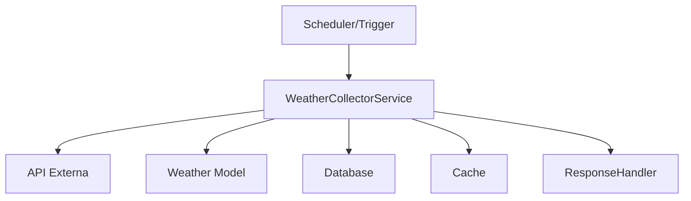

# Manual do WeatherCollectorService - AgTech Portugal

## 📋 Visão Geral

O **WeatherCollectorService** é responsável pela coleta, armazenamento e atualização de dados climáticos no sistema AgTech Portugal. Ele integra fontes externas de dados meteorológicos, processa e armazena as informações no banco local, garantindo a atualização periódica e a qualidade dos dados.

---

## 🎯 Funcionalidades Principais

### ✅ Recursos Implementados
1. **Coleta Periódica de Dados Climáticos** - Integração com APIs externas
2. **Armazenamento no Banco Local** - Persistência de dados meteorológicos
3. **Processamento e Normalização** - Conversão e validação dos dados recebidos
4. **Atualização de Registros Existentes** - Evita duplicidade e mantém histórico
5. **Execução Agendada** - Suporte a agendamento automático de coletas

---

## 🏗️ Arquitetura do Serviço

### 📂 Estrutura de Arquivos
```
app/
├── services/
│   └── weather_collector.py           # Serviço principal
├── models/
│   └── weather.py                     # Modelo de dados climáticos
└── middleware/
    └── scheduler.py                   # Agendador de tarefas (opcional)
```

### 🔄 Fluxo de Dados


---

## 📊 Modelos de Dados

### ☁️ Weather Model
```python
class Weather(db.Model):
    id: int
    data: datetime
    temperatura: float
    umidade: float
    precipitacao: float
    vento: float
    localizacao: str
    latitude: float
    longitude: float
    fonte: str
    # ... outros campos ...
```

---

## 🔧 Métodos do Serviço

### 1. **collect_weather_data**
#### 📝 Descrição
Coleta dados climáticos de fontes externas e armazena no banco local.

#### 📥 Entrada
```python
def collect_weather_data(source: str, location: str = None, latitude: float = None, longitude: float = None) -> List[Weather]
```
- `source` (str): Nome da fonte externa
- `location` (str, opcional): Nome da localidade
- `latitude` (float, opcional): Coordenada
- `longitude` (float, opcional): Coordenada

#### 📤 Saída
Lista de registros de clima coletados

---

### 2. **schedule_collection**
#### 📝 Descrição
Agenda a coleta periódica de dados climáticos.

#### 📥 Entrada
```python
def schedule_collection(interval: int) -> None
```
- `interval` (int): Intervalo em minutos

#### 📤 Saída
Nenhuma (executa em background)

---

### 3. **process_and_store_data**
#### 📝 Descrição
Processa, valida e armazena dados recebidos de APIs externas.

#### 📥 Entrada
```python
def process_and_store_data(raw_data: dict) -> Weather
```
- `raw_data` (dict): Dados brutos da API

#### 📤 Saída
Registro de clima armazenado

---

## 📚 Exemplos de Uso

### 1. Coletar Dados Manualmente
```python
from app.services.weather_collector import WeatherCollectorService
service = WeatherCollectorService()
registros = service.collect_weather_data(source='OpenWeather', location='Lisboa')
for registro in registros:
    print(registro.temperatura)
```

### 2. Agendar Coleta
```python
service.schedule_collection(interval=60)  # Executa a cada 60 minutos
```

---

## 🔒 Dependências do Serviço
- **Weather Model**: Para persistência dos dados
- **APIs Externas**: Para coleta de dados
- **Scheduler**: Para execução periódica (opcional)
- **Cache**: Para performance

---

## 🔍 Validações
- Valida integridade dos dados recebidos
- Checa duplicidade antes de inserir
- Normaliza formatos de dados

---

## 🛡️ Segurança
- Apenas fontes autorizadas podem ser utilizadas
- Proteção contra inserção de dados inválidos

---

## 📈 Performance e Otimização
- Uso de cache para dados recentes
- Execução assíncrona e agendada

---

## 🧪 Testes
```python
import unittest
from app.services.weather_collector import WeatherCollectorService

class TestWeatherCollectorService(unittest.TestCase):
    def setUp(self):
        self.service = WeatherCollectorService()
    def test_collect_weather_data(self):
        registros = self.service.collect_weather_data(source='OpenWeather', location='Lisboa')
        self.assertIsInstance(registros, list)
```

---

## 💡 Independência do Serviço
- Pode ser adaptado para qualquer sistema que precise coletar e armazenar dados climáticos
- Basta garantir dependências mínimas (modelos, APIs, scheduler)

---

## 📝 Conclusão

O **WeatherCollectorService** garante a atualização e qualidade dos dados climáticos, sendo essencial para sistemas agrícolas digitais que dependem de informações meteorológicas confiáveis.

---

*Manual gerado em: 07 de agosto de 2025*  
*Versão: 1.0*  
*Sistema: AgTech Portugal - WeatherCollectorService
