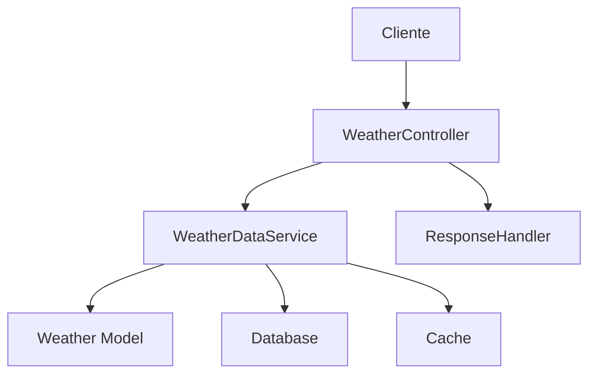

# Manual do WeatherDataService - AgTech Portugal

## 📋 Visão Geral

O **WeatherDataService** é o serviço principal de dados climáticos do sistema AgTech Portugal. Ele fornece acesso a informações meteorológicas atuais, históricas e previsões, exclusivamente a partir do banco de dados local, sem chamadas para APIs externas.

---

## 🎯 Funcionalidades Principais

### ✅ Recursos Implementados
1. **Consulta de Dados Climáticos Atuais** - Busca por localização ou coordenadas
2. **Histórico Climático** - Acesso a registros passados
3. **Previsões** - Projeções baseadas em dados locais
4. **Dados por Localização** - Suporte a busca por nome ou coordenadas
5. **Cache Otimizado** - Performance em consultas frequentes

---

## 🏗️ Arquitetura do Serviço

### 📂 Estrutura de Arquivos
```
app/
├── services/
│   └── weather_data_service.py         # Serviço principal
├── controllers/
│   └── weather_controller.py           # Controlador REST
├── models/
│   └── weather.py                      # Modelo de dados climáticos
└── middleware/
    └── cache.py                        # Cache (opcional)
```

### 🔄 Fluxo de Dados


---

## 📊 Modelos de Dados

### ☁️ Weather Model
```python
class Weather(db.Model):
    id: int
    data: datetime
    temperatura: float
    umidade: float
    precipitacao: float
    vento: float
    localizacao: str
    latitude: float
    longitude: float
    # ... outros campos ...
```

---

## 🔧 Métodos do Serviço

### 1. **get_current_weather**
#### 📝 Descrição
Obtém dados climáticos atuais para uma localização.

#### 📥 Entrada
```python
def get_current_weather(location: str = None, latitude: float = None, longitude: float = None) -> dict
```
- `location` (str, opcional): Nome da localidade
- `latitude` (float, opcional): Coordenada
- `longitude` (float, opcional): Coordenada

#### 📤 Saída
Dicionário com dados climáticos atuais

---

### 2. **get_weather_history**
#### 📝 Descrição
Retorna histórico climático para uma localização.

#### 📥 Entrada
```python
def get_weather_history(location: str = None, latitude: float = None, longitude: float = None, days: int = 30) -> List[dict]
```
- `location` (str, opcional)
- `latitude` (float, opcional)
- `longitude` (float, opcional)
- `days` (int, opcional): Quantidade de dias

#### 📤 Saída
Lista de registros climáticos

---

### 3. **get_weather_forecast**
#### 📝 Descrição
Obtém previsão do tempo baseada em dados locais.

#### 📥 Entrada
```python
def get_weather_forecast(location: str = None, latitude: float = None, longitude: float = None, days: int = 7) -> List[dict]
```
- `location` (str, opcional)
- `latitude` (float, opcional)
- `longitude` (float, opcional)
- `days` (int, opcional): Dias de previsão

#### 📤 Saída
Lista de previsões

---

## 📚 Exemplos de Uso

### 1. Obter Clima Atual
```python
from app.services.weather_data_service import WeatherDataService
service = WeatherDataService()
dados = service.get_current_weather(location='Lisboa')
print(dados['temperatura'])
```

### 2. Histórico Climático
```python
historico = service.get_weather_history(latitude=38.7, longitude=-9.1, days=15)
for registro in historico:
    print(registro['data'], registro['temperatura'])
```

### 3. Previsão do Tempo
```python
previsao = service.get_weather_forecast(location='Porto', days=5)
for dia in previsao:
    print(dia['data'], dia['temperatura'])
```

---

## 🔒 Dependências do Serviço
- **Weather Model**: Para persistência dos dados
- **Cache**: Para performance
- **Database**: Para consultas

---

## 🔍 Validações
- Checa existência de dados para a localização
- Valida integridade dos dados retornados

---

## 🛡️ Segurança
- Apenas dados do banco local são utilizados
- Não expõe dados sensíveis

---

## 📈 Performance e Otimização
- Uso de cache para consultas frequentes
- Índices no banco para buscas rápidas

---

## 🧪 Testes
```python
import unittest
from app.services.weather_data_service import WeatherDataService

class TestWeatherDataService(unittest.TestCase):
    def setUp(self):
        self.service = WeatherDataService()
    def test_get_current_weather(self):
        dados = self.service.get_current_weather(location='Lisboa')
        self.assertIn('temperatura', dados)
    def test_get_weather_history(self):
        historico = self.service.get_weather_history(location='Lisboa', days=5)
        self.assertIsInstance(historico, list)
```

---

## 💡 Independência do Serviço
- Pode ser adaptado para qualquer sistema que possua banco local de dados climáticos
- Basta garantir dependências mínimas (modelos, banco, cache)

---

## 📝 Conclusão

O **WeatherDataService** centraliza o acesso a dados climáticos, promovendo confiabilidade e performance para sistemas agrícolas digitais.

---

*Manual gerado em: 07 de agosto de 2025*  
*Versão: 1.0*  
*Sistema: AgTech Portugal - WeatherDataService
