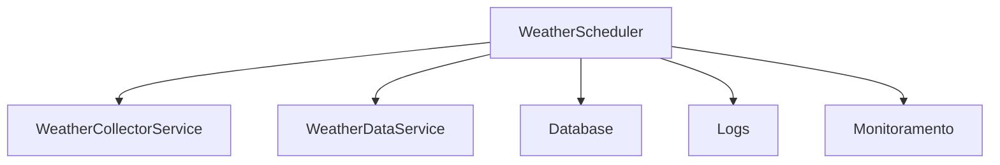

# Manual do WeatherScheduler - AgTech Portugal

## 📋 Visão Geral

O **WeatherScheduler** é responsável pelo agendamento e execução automática de tarefas relacionadas à coleta e processamento de dados climáticos no sistema AgTech Portugal. Ele garante que as rotinas de atualização, coleta e análise de dados ocorram em intervalos regulares, sem necessidade de intervenção manual.

---

## 🎯 Funcionalidades Principais

### ✅ Recursos Implementados
1. **Agendamento de Coletas Climáticas** - Execução automática de tarefas
2. **Execução de Processamentos Periódicos** - Atualização e análise de dados
3. **Integração com WeatherCollectorService** - Dispara coletas programadas
4. **Gestão de Tarefas em Background** - Suporte a múltiplos jobs
5. **Logs e Monitoramento de Execução** - Registro de status e falhas

---

## 🏗️ Arquitetura do Serviço

### 📂 Estrutura de Arquivos
```
app/
├── services/
│   └── weather_scheduler.py           # Serviço principal
├── services/
│   └── weather_collector.py           # Serviço de coleta
└── middleware/
    └── scheduler.py                   # Agendador de tarefas (opcional)
```

### 🔄 Fluxo de Dados


---

## 🔧 Métodos do Serviço

### 1. **schedule_task**
#### 📝 Descrição
Agenda uma tarefa de coleta ou processamento climático.

#### 📥 Entrada
```python
def schedule_task(task_name: str, interval: int, args: dict = None) -> None
```
- `task_name` (str): Nome da tarefa
- `interval` (int): Intervalo em minutos
- `args` (dict, opcional): Parâmetros adicionais

#### 📤 Saída
Nenhuma (executa em background)

---

### 2. **run_scheduled_tasks**
#### 📝 Descrição
Executa todas as tarefas agendadas no momento correto.

#### 📥 Entrada
```python
def run_scheduled_tasks() -> None
```

#### 📤 Saída
Nenhuma (executa em background)

---

### 3. **cancel_task**
#### 📝 Descrição
Cancela uma tarefa agendada.

#### 📥 Entrada
```python
def cancel_task(task_name: str) -> bool
```
- `task_name` (str): Nome da tarefa

#### 📤 Saída
`True` se cancelada com sucesso

---

## 📚 Exemplos de Uso

### 1. Agendar Coleta Climática
```python
from app.services.weather_scheduler import WeatherScheduler
scheduler = WeatherScheduler()
scheduler.schedule_task('coleta_lisboa', interval=60, args={'location': 'Lisboa'})
```

### 2. Executar Tarefas Agendadas
```python
scheduler.run_scheduled_tasks()
```

### 3. Cancelar Tarefa
```python
scheduler.cancel_task('coleta_lisboa')
```

---

## 🔒 Dependências do Serviço
- **WeatherCollectorService**: Para execução das coletas
- **WeatherDataService**: Para atualização de dados
- **Scheduler**: Para agendamento e execução
- **Logs/Monitoramento**: Para registro de execuções

---

## 🔍 Validações
- Checa existência e validade das tarefas
- Valida intervalos e parâmetros
- Garante que tarefas não se sobreponham

---

## 🛡️ Segurança
- Apenas tarefas autorizadas podem ser agendadas
- Proteção contra execuções concorrentes

---

## 📈 Performance e Otimização
- Execução assíncrona de múltiplas tarefas
- Logs para análise de performance

---

## 🧪 Testes
```python
import unittest
from app.services.weather_scheduler import WeatherScheduler

class TestWeatherScheduler(unittest.TestCase):
    def setUp(self):
        self.scheduler = WeatherScheduler()
    def test_schedule_task(self):
        self.scheduler.schedule_task('coleta_test', interval=30)
        # Verificar se tarefa foi agendada (mock)
    def test_cancel_task(self):
        self.assertTrue(self.scheduler.cancel_task('coleta_test'))
```

---

## 💡 Independência do Serviço
- Pode ser adaptado para qualquer sistema que exija agendamento de tarefas periódicas
- Basta garantir dependências mínimas (serviços, scheduler, logs)

---

## 📝 Conclusão

O **WeatherScheduler** automatiza e garante a regularidade das operações climáticas, promovendo confiabilidade e eficiência para sistemas agrícolas digitais.

---

*Manual gerado em: 07 de agosto de 2025*  
*Versão: 1.0*  
*Sistema: AgTech Portugal - WeatherScheduler
